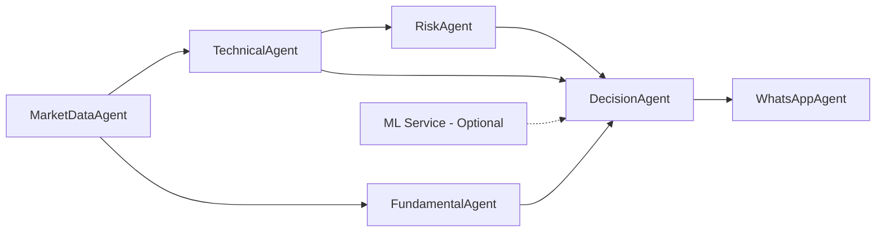
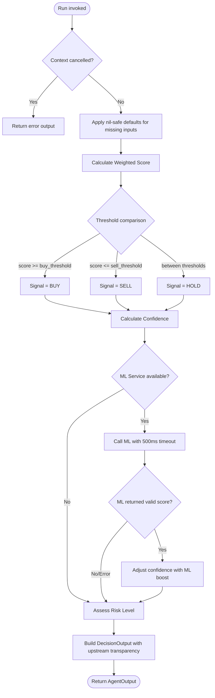
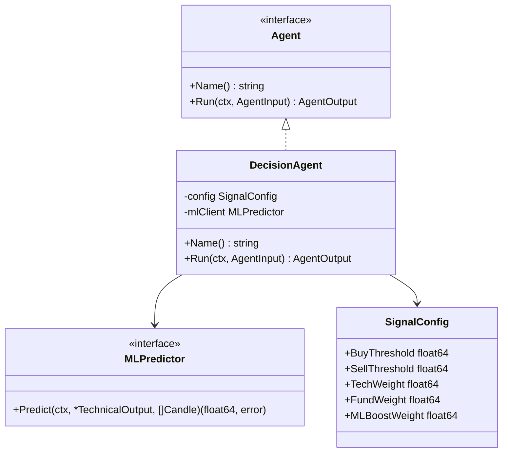

# Design Document: DecisionAgent (Agent 5)

## Overview

DecisionAgent is the final decision-making component in the forex multi-agent pipeline. It aggregates outputs from TechnicalAgent (Agent 2), FundamentalAgent (Agent 3), and RiskAgent (Agent 4) to produce a unified trading signal (BUY, SELL, or HOLD) with confidence scoring, risk level assessment, and full upstream data transparency.

The agent follows a pure computation model: it receives upstream data, applies configurable weighted scoring and threshold-based signal determination, and outputs a complete `DecisionOutput`. The design prioritizes:

- **Determinism**: Given the same inputs and config, the output is always identical
- **Graceful degradation**: Missing upstream outputs (nil Technical, nil Fundamental, nil Risk) produce safe defaults (HOLD with appropriate confidence)
- **Testability**: Interface-based dependency injection for the ML service enables full unit/property testing without external services
- **Consistency**: Follows established patterns from TechnicalAgent and FundamentalAgent (compile-time interface check, context cancellation first, `errorOutput` helper)

## Architecture

### High-Level Pipeline Position



### Decision Agent Internal Flow



### Design Decisions

| Decision | Rationale |
|----------|-----------|
| Interface for ML client (`MLPredictor`) | Enables testing without gRPC; matches FundamentalAgent DI pattern |
| Config validation at construction time | Invalid configs fall back to defaults silently; avoids runtime panics |
| No context check after ML call | Architecture doc says ML timeout = proceed without; only initial ctx check aborts |
| Always return non-nil DecisionOutput on success | Downstream agents (WhatsAppAgent) depend on non-nil decision |
| Weighted score drives signal, not rule matching | Threshold-based is more configurable than hard-coded rule alignment |

## Components and Interfaces

### 1. MLPredictor Interface

```go
// MLPredictor abstracts the ML prediction service for dependency injection.
// Implementations: real gRPC client (internal/ml/client.go), nil-safe no-op, test mocks.
type MLPredictor interface {
    // Predict returns a confidence boost score (0.0–1.0) for the given technical state.
    // Returns (0.0, error) if unavailable. Callers must enforce their own timeout via ctx.
    Predict(ctx context.Context, tech *TechnicalOutput, candles []Candle) (float64, error)
}
```

### 2. SignalConfig Struct

```go
// SignalConfig holds configurable parameters for signal generation.
// Loaded from config.yaml `signal` section.
type SignalConfig struct {
    BuyThreshold  float64 // Score >= this → BUY (default: 0.65)
    SellThreshold float64 // Score <= this → SELL (default: 0.35)
    TechWeight    float64 // Weight for technical score (default: 0.60)
    FundWeight    float64 // Weight for fundamental score (default: 0.40)
    MLBoostWeight float64 // Weight for ML confidence boost (default: 0.20)
}
```

### 3. DecisionAgent Struct

```go
// DecisionAgent (Agent 5) produces the final trading signal.
type DecisionAgent struct {
    config   SignalConfig
    mlClient MLPredictor // may be nil
}
```

### 4. Constructor

```go
// NewDecisionAgent creates a new DecisionAgent with validated config.
// If config has invalid weights or thresholds, defaults are applied.
// mlClient may be nil to indicate ML service is unavailable.
func NewDecisionAgent(config SignalConfig, mlClient MLPredictor) *DecisionAgent
```

### 5. Component Relationships



## Data Models

### Input Dependencies

| Field | Source | Nil-safe Default |
|-------|--------|-----------------|
| `AgentInput.Technical` | TechnicalAgent output | Score=0.5, Confidence=0.5, Signal="HOLD" |
| `AgentInput.Fundamental` | FundamentalAgent output | Score=0.5, Confidence=0.5, Sentiment="neutral" |
| `AgentInput.Risk` | RiskAgent output | LotSize=0, SL=0, TP=0 |
| `AgentInput.Candles` | MarketDataAgent buffer | Entry=0 if empty |
| `AgentInput.Pair` | Pipeline orchestrator | Passed through to output |
| `AgentInput.RiskPercent` | Account config | Passed through as-is |

### SignalConfig Validation Rules

```go
// DefaultSignalConfig returns safe defaults matching config.yaml.
func DefaultSignalConfig() SignalConfig {
    return SignalConfig{
        BuyThreshold:  0.65,
        SellThreshold: 0.35,
        TechWeight:    0.60,
        FundWeight:    0.40,
        MLBoostWeight: 0.20,
    }
}

// validateConfig normalizes a SignalConfig, applying defaults for invalid values.
// Rules:
//   - Weights must each be in [0.0, 1.0] AND sum to 1.0; else use defaults
//   - sell_threshold must be < buy_threshold; both in [0.0, 1.0]; else use defaults
//   - MLBoostWeight must be in [0.0, 1.0]; else use default 0.20
func validateConfig(cfg SignalConfig) SignalConfig
```

### Core Computation Functions (Pseudocode)

#### `calcWeightedScore`

```
func calcWeightedScore(tech *TechnicalOutput, fund *FundamentalOutput, cfg SignalConfig) float64:
    techScore = 0.5  // default if nil
    fundScore = 0.5  // default if nil
    
    if tech != nil:
        techScore = tech.TechScore
    if fund != nil:
        fundScore = fund.Score
    
    // Clamp inputs to [0.0, 1.0]
    techScore = clamp(techScore, 0.0, 1.0)
    fundScore = clamp(fundScore, 0.0, 1.0)
    
    return (techScore * cfg.TechWeight) + (fundScore * cfg.FundWeight)
```

#### `determineSignal`

```
func determineSignal(weightedScore float64, cfg SignalConfig) string:
    if weightedScore >= cfg.BuyThreshold:
        return "BUY"
    if weightedScore <= cfg.SellThreshold:
        return "SELL"
    return "HOLD"
```

#### `calcConfidence`

```
func calcConfidence(tech *TechnicalOutput, fund *FundamentalOutput, cfg SignalConfig) float64:
    techConf = 0.5  // default if nil
    fundConf = 0.5  // default if nil
    
    if tech != nil:
        techConf = tech.Confidence
    if fund != nil:
        fundConf = fund.Confidence
    
    // Clamp to [0.0, 1.0]
    techConf = clamp(techConf, 0.0, 1.0)
    fundConf = clamp(fundConf, 0.0, 1.0)
    
    return (techConf * cfg.TechWeight) + (fundConf * cfg.FundWeight)
```

#### `applyMLBoost`

```
func applyMLBoost(ctx context.Context, baseConf float64, mlClient MLPredictor, tech *TechnicalOutput, candles []Candle, cfg SignalConfig) float64:
    if mlClient == nil:
        return baseConf
    
    // Create child context with 500ms timeout
    mlCtx, cancel = context.WithTimeout(ctx, 500ms)
    defer cancel()
    
    mlScore, err = mlClient.Predict(mlCtx, tech, candles)
    if err != nil || mlScore <= 0.0:
        return baseConf
    
    // Apply ML boost: blend base confidence with ML score
    return (baseConf * (1.0 - cfg.MLBoostWeight)) + (mlScore * cfg.MLBoostWeight)
```

#### `assessRiskLevel`

```
func assessRiskLevel(confidence float64) string:
    if confidence >= 0.75:
        return "LOW"
    if confidence >= 0.50:
        return "MEDIUM"
    return "HIGH"
```

#### `Run` (Full Pseudocode)

```
func (a *DecisionAgent) Run(ctx context.Context, input AgentInput) AgentOutput:
    // 1. Context cancellation check
    if ctx.Err() != nil:
        return errorOutput(a.Name(), ctx.Err())
    
    // 2. Extract upstream outputs (nil-safe)
    tech := input.Technical
    fund := input.Fundamental
    risk := input.Risk
    
    // 3. Calculate weighted score
    weightedScore := calcWeightedScore(tech, fund, a.config)
    
    // 4. Determine signal from thresholds
    signal := determineSignal(weightedScore, a.config)
    
    // 5. Calculate base confidence
    confidence := calcConfidence(tech, fund, a.config)
    
    // 6. Optional ML boost
    mlScore := 0.0
    if a.mlClient != nil:
        mlCtx, cancel := context.WithTimeout(ctx, 500ms)
        score, err := a.mlClient.Predict(mlCtx, tech, input.Candles)
        cancel()
        if err == nil && score > 0:
            mlScore = score
            confidence = (confidence * (1.0 - a.config.MLBoostWeight)) + (mlScore * a.config.MLBoostWeight)
    
    // 7. Assess risk level
    riskLevel := assessRiskLevel(confidence)
    
    // 8. Build entry/SL/TP from risk output
    entry, sl, tp, lot := 0.0, 0.0, 0.0, 0.0
    if signal != "HOLD" && risk != nil:
        if len(input.Candles) > 0:
            entry = input.Candles[len(input.Candles)-1].Close
        sl = risk.StopLoss
        tp = risk.TakeProfit
        lot = risk.LotSize
    
    // 9. Build upstream transparency fields
    techSignal, techConf, techReason := "HOLD", 0.5, ""
    if tech != nil:
        techSignal = tech.Signal
        techConf = tech.Confidence
        techReason = tech.Reason
    
    fundSent, fundConf, fundReason := "neutral", 0.5, ""
    if fund != nil:
        fundSent = fund.Sentiment
        fundConf = fund.Confidence
        fundReason = fund.Reason
    
    // 10. Return complete output
    return AgentOutput{
        AgentName: "DecisionAgent",
        Success:   true,
        Timestamp: time.Now(),
        Decision: &DecisionOutput{
            Signal:        signal,
            Confidence:    confidence,
            ConfPct:       int(confidence * 100),
            Entry:         entry,
            StopLoss:      sl,
            TakeProfit:    tp,
            LotSize:       lot,
            RiskPct:       input.RiskPercent,
            TechSignal:    techSignal,
            TechConf:      techConf,
            TechReason:    techReason,
            FundSentiment: fundSent,
            FundConf:      fundConf,
            FundReason:    fundReason,
            MLScore:       mlScore,
            RiskLevel:     riskLevel,
            Pair:          input.Pair,
            Timestamp:     time.Now(),
        },
    }
```


## Correctness Properties

*A property is a characteristic or behavior that should hold true across all valid executions of a system — essentially, a formal statement about what the system should do. Properties serve as the bridge between human-readable specifications and machine-verifiable correctness guarantees.*

### Property 1: Weighted Score Calculation

*For any* TechnicalOutput with TechScore in [0,1] and any FundamentalOutput with Score in [0,1] (either of which may be nil, defaulting to 0.5), the DecisionAgent's weighted score SHALL equal `(techScore × techWeight) + (fundScore × fundWeight)` where techWeight and fundWeight come from the validated SignalConfig, and the result is always in [0,1].

**Validates: Requirements 2.1, 2.3, 2.4**

### Property 2: Signal Determination by Threshold Partition

*For any* weighted score value in [0,1] and any valid SignalConfig thresholds where sell_threshold < buy_threshold, the signal SHALL be exactly one of: BUY (if score >= buy_threshold), SELL (if score <= sell_threshold), or HOLD (otherwise). These three regions form a complete, non-overlapping partition of [0,1].

**Validates: Requirements 3.1, 3.2, 3.3**

### Property 3: Confidence Calculation

*For any* TechnicalOutput with Confidence in [0,1] and any FundamentalOutput with Confidence in [0,1] (either of which may be nil, defaulting to 0.5), the DecisionAgent's overall confidence SHALL equal `(techConf × techWeight) + (fundConf × fundWeight)` and the ConfPct field SHALL equal `int(confidence × 100)`.

**Validates: Requirements 4.1, 4.2, 4.3, 4.4**

### Property 4: ML Boost Formula

*For any* base confidence in [0,1] and any ML score in (0,1], when the MLPredictor returns a valid score, the adjusted confidence SHALL equal `(baseConf × (1.0 - mlBoostWeight)) + (mlScore × mlBoostWeight)`, and the result remains in [0,1].

**Validates: Requirements 5.2**

### Property 5: Risk Level Classification

*For any* final confidence value in [0,1], the Risk_Level SHALL be "LOW" if confidence >= 0.75, "MEDIUM" if confidence in [0.50, 0.75), or "HIGH" if confidence < 0.50. This SHALL be populated for every signal type (BUY, SELL, HOLD) without exception.

**Validates: Requirements 6.1, 6.2, 6.3, 6.4**

### Property 6: Config Validation Fallback

*For any* SignalConfig where weights do not sum to 1.0 or are outside [0,1], or where sell_threshold >= buy_threshold or thresholds are outside [0,1], the DecisionAgent SHALL produce identical results to using the default config (BuyThreshold=0.65, SellThreshold=0.35, TechWeight=0.60, FundWeight=0.40) given the same inputs.

**Validates: Requirements 2.2, 2.5, 3.4, 3.5**

### Property 7: Upstream Data Transparency

*For any* non-nil TechnicalOutput and FundamentalOutput provided as input, the DecisionOutput SHALL contain TechSignal == Technical.Signal, TechConf == Technical.Confidence, TechReason == Technical.Reason, FundSentiment == Fundamental.Sentiment, FundConf == Fundamental.Confidence, FundReason == Fundamental.Reason, Pair == input.Pair, and RiskPct == input.RiskPercent.

**Validates: Requirements 7.1, 7.2, 7.6, 10.4**

### Property 8: HOLD Signal Zeroes Risk Parameters

*For any* input combination that produces a HOLD signal, the DecisionOutput SHALL contain Entry=0.0, StopLoss=0.0, TakeProfit=0.0, and LotSize=0.0, regardless of whether Risk_Output is available.

**Validates: Requirements 7.5, 10.3**

### Property 9: BUY/SELL Signal Passes Risk Parameters

*For any* input combination that produces a BUY or SELL signal: if Risk_Output is non-nil, then DecisionOutput.StopLoss == Risk.StopLoss, DecisionOutput.TakeProfit == Risk.TakeProfit, DecisionOutput.LotSize == Risk.LotSize, and Entry == last candle close price. If Risk_Output is nil, all four SHALL be 0.0.

**Validates: Requirements 7.4, 10.1, 10.2**

### Property 10: Guaranteed Valid Output Invariant

*For any* AgentInput with a non-cancelled context, the DecisionAgent SHALL return AgentOutput with Success=true and a non-nil Decision pointer, regardless of which upstream outputs are nil.

**Validates: Requirements 8.1, 8.5**

## Error Handling

The DecisionAgent follows the same error handling patterns as existing agents:

### Context Cancellation (First Check)

```go
if ctx.Err() != nil {
    return errorOutput(a.Name(), fmt.Errorf("context cancelled: %w", ctx.Err()))
}
```

This is the **only** condition that produces `Success: false`. All other code paths return `Success: true` with a valid DecisionOutput.

### Nil Upstream Handling (Graceful Degradation)

| Nil Input | Behavior |
|-----------|----------|
| `Technical == nil` | Use TechScore=0.5, Confidence=0.5, Signal="HOLD" for calculation; output TechConf=0.0 for transparency |
| `Fundamental == nil` | Use Score=0.5, Confidence=0.5 for calculation; output FundSentiment="neutral", FundConf=0.5 |
| `Risk == nil` | Output Entry/SL/TP/Lot = 0.0 even for BUY/SELL |
| `Candles` empty | Entry = 0.0 |
| `mlClient == nil` | Skip ML boost entirely, MLScore=0.0 |

### ML Service Failure

The ML service uses a child context with 500ms timeout. Failures are silently swallowed — the agent proceeds with base confidence. This matches the architecture doc's "optional Phase 2" positioning.

```go
mlCtx, cancel := context.WithTimeout(ctx, 500*time.Millisecond)
defer cancel()
score, err := a.mlClient.Predict(mlCtx, tech, input.Candles)
if err != nil {
    // Log error (optional), proceed without ML boost
    mlScore = 0.0
}
```

### Config Validation

Invalid configs are normalized at construction time in `validateConfig()`. No runtime errors are produced from bad config — the agent always has usable parameters.

## Testing Strategy

### Property-Based Testing (pgregory.net/rapid)

The project already uses `pgregory.net/rapid` (see go.mod). Each correctness property maps to one property-based test with minimum 100 iterations.

**Test File:** `internal/agents/decision_agent_test.go`

**Generators needed:**
- `genTechnicalOutput()` — random TechScore, Confidence in [0,1], Signal from {BUY,SELL,HOLD}, random Reason string
- `genFundamentalOutput()` — random Score, Confidence in [0,1], Sentiment from {bullish,bearish,neutral}, random Reason
- `genRiskOutput()` — random LotSize, StopLoss, TakeProfit (positive floats)
- `genSignalConfig()` — random valid config (weights sum to 1, thresholds ordered)
- `genInvalidSignalConfig()` — random invalid config (weights don't sum, thresholds unordered)
- `genCandles(n)` — slice of n random candles with valid Close prices

**Property Test Tags:**
```go
// Feature: decision-agent, Property 1: Weighted Score Calculation
// Feature: decision-agent, Property 2: Signal Determination by Threshold Partition
// etc.
```

**Configuration:** Each `rapid.Check` runs with default iterations (100+).

### Unit Tests (Example-Based)

Specific examples and edge cases not covered by property tests:

| Test Case | Validates |
|-----------|-----------|
| `TestNewDecisionAgent_NilML` | Req 1.2 — constructor accepts nil mlClient |
| `TestRun_ContextCancelled` | Req 9.1, 9.3 — immediate error return |
| `TestRun_NilTech_Transparency` | Req 7.7 — TechSignal="HOLD", TechConf=0.0 |
| `TestRun_NilFund_Transparency` | Req 7.3 — FundSentiment="neutral", FundConf=0.5 |
| `TestRun_BothNil_Output` | Req 8.2, 8.3 — HOLD with defaults |
| `TestRun_MLTimeout` | Req 5.3 — proceeds without ML boost |
| `TestRun_MLReturnsScore` | Req 5.4 — MLScore field populated |
| `TestRun_MLDisabled` | Req 5.5 — MLScore=0.0 |
| `TestRun_MLContextCancel` | Req 9.4 — ML failure doesn't abort |

### Integration Test Considerations

- ML gRPC integration: test with real/mocked gRPC server for timeout behavior
- Pipeline integration: verify DecisionAgent output is consumable by WhatsAppAgent

### Test Organization

```
internal/agents/
├── decision_agent.go          # Implementation
├── decision_agent_test.go     # Property + unit tests
└── decision_agent_helpers_test.go  # Generators and test utilities
```
