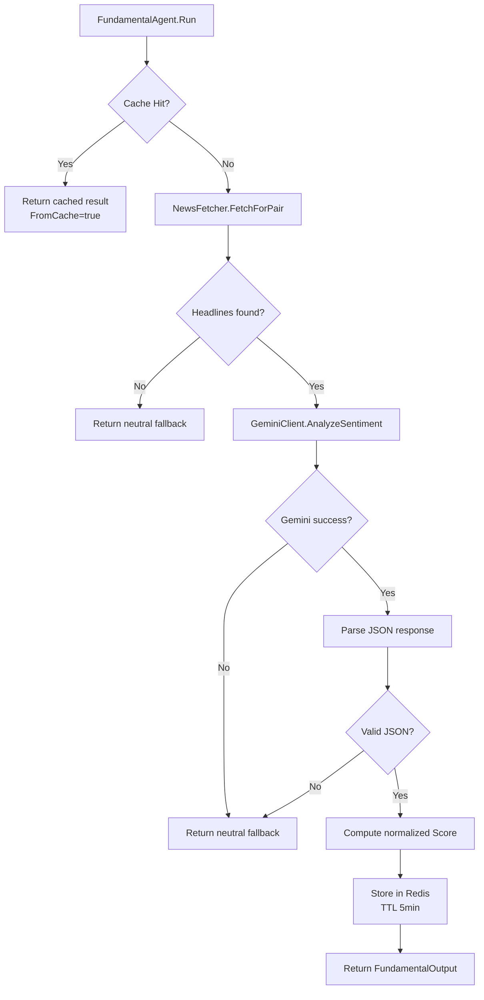
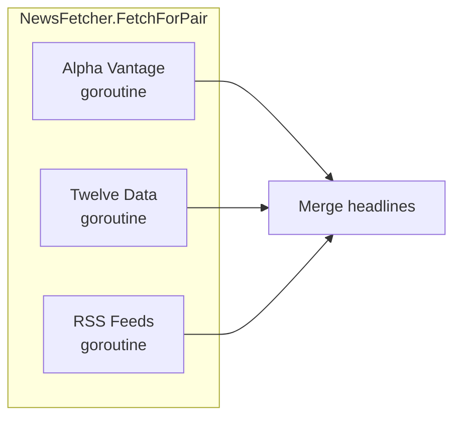

# Design Document: FundamentalAgent

## Overview

FundamentalAgent (Agent 3) analyzes economic news headlines to produce sentiment signals for currency pairs. It integrates into the multi-agent forex pipeline alongside TechnicalAgent (Agent 2), consuming the same `AgentInput` and returning a populated `FundamentalOutput` within the standard `AgentOutput` envelope.

The agent follows a three-stage pipeline:

1. **Cache Check** — Query Redis for a cached sentiment result for the pair
2. **News Fetching** — Retrieve headlines from Alpha Vantage, Twelve Data, and RSS feeds concurrently
3. **NLP Analysis** — Send headlines to Gemini API for sentiment classification

The design prioritizes fault tolerance: every failure path (no news, Gemini timeout, Redis down) produces a valid neutral fallback so downstream agents never receive nil data.

## Architecture



### Concurrency Model

News sources are fetched concurrently using goroutines with a shared `errgroup`. Each source runs independently; partial failures are tolerated. The agent itself is called as a goroutine by the orchestrator (concurrent with TechnicalAgent).



## Components and Interfaces

### Package Layout

```
internal/
├── agents/
│   └── fundamental_agent.go    # FundamentalAgent struct, Run()
└── sentiment/
    ├── gemini.go               # GeminiClient — Gemini API interaction
    ├── news_fetcher.go         # NewsFetcher — multi-source headline retrieval
    └── cache.go                # SentimentCache — Redis cache layer
```

### Component Interfaces

```go
// sentiment/news_fetcher.go
type NewsFetcher struct {
    alphaVantageKey string
    twelveDataKey   string
    rssURLs         []string
    httpClient      *http.Client
}

func NewNewsFetcher(avKey, tdKey string, rssURLs []string) *NewsFetcher
func (f *NewsFetcher) FetchForPair(ctx context.Context, pair string) ([]string, error)
```

```go
// sentiment/gemini.go
type GeminiClient struct {
    apiKey  string
    model   string
    timeout time.Duration
    client  *http.Client
}

type SentimentResult struct {
    Sentiment  string  `json:"sentiment"`
    Confidence float64 `json:"confidence"`
    Reason     string  `json:"reason"`
    FromCache  bool    `json:"-"`
}

func NewGeminiClient(apiKey, model string, timeout time.Duration) *GeminiClient
func (g *GeminiClient) AnalyzeSentiment(ctx context.Context, pair string, headlines []string) SentimentResult
```

```go
// sentiment/cache.go
type SentimentCache struct {
    client *redis.Client
    ttl    time.Duration
}

func NewSentimentCache(client *redis.Client, ttl time.Duration) *SentimentCache
func (c *SentimentCache) Get(ctx context.Context, pair string) (*SentimentResult, error)
func (c *SentimentCache) Set(ctx context.Context, pair string, result SentimentResult) error
```

```go
// agents/fundamental_agent.go
type FundamentalAgent struct {
    gemini *sentiment.GeminiClient
    news   *sentiment.NewsFetcher
    cache  *sentiment.SentimentCache
}

func NewFundamentalAgent(gemini *sentiment.GeminiClient, news *sentiment.NewsFetcher, cache *sentiment.SentimentCache) *FundamentalAgent
func (a *FundamentalAgent) Name() string
func (a *FundamentalAgent) Run(ctx context.Context, input AgentInput) AgentOutput
```

### Dependency Injection

All external dependencies (HTTP clients, Redis client) are injected through constructors. This enables testing with mocks/fakes without hitting real services.

For testability, interfaces can be introduced:

```go
// sentiment/interfaces.go (optional, for mocking)
type HeadlineFetcher interface {
    FetchForPair(ctx context.Context, pair string) ([]string, error)
}

type SentimentAnalyzer interface {
    AnalyzeSentiment(ctx context.Context, pair string, headlines []string) SentimentResult
}

type CacheStore interface {
    Get(ctx context.Context, pair string) (*SentimentResult, error)
    Set(ctx context.Context, pair string, result SentimentResult) error
}
```

## Data Models

### SentimentResult (internal)

| Field      | Type    | Description                          | Constraints              |
|-----------|---------|--------------------------------------|--------------------------|
| Sentiment | string  | Sentiment direction                  | "bullish" \| "bearish" \| "neutral" |
| Confidence| float64 | Analysis confidence level            | [0.0, 1.0]              |
| Reason    | string  | Short explanation                    | ≤ 15 words              |
| FromCache | bool    | Whether result was served from cache | —                        |

### FundamentalOutput (existing, in agent.go)

| Field      | Type    | Description                          | Derivation                          |
|-----------|---------|--------------------------------------|-------------------------------------|
| Sentiment | string  | Sentiment direction                  | From SentimentResult                |
| Confidence| float64 | Confidence level                     | From SentimentResult                |
| Score     | float64 | Normalized score for DecisionAgent   | Computed from Sentiment + Confidence|
| Reason    | string  | Short explanation                    | From SentimentResult                |
| FromCache | bool    | Cache indicator                      | From SentimentResult                |

### Score Normalization Formula

```
bullish  → Score = 0.5 + (Confidence × 0.5)   → range [0.5, 1.0]
bearish  → Score = 0.5 - (Confidence × 0.5)   → range [0.0, 0.5]
neutral  → Score = 0.5
```

### Redis Cache Key Format

```
sentiment:{pair}
```

Example: `sentiment:EUR_USD`

### Gemini Prompt Template

```
You are a professional forex market analyst.
Analyze the sentiment impact of these news headlines on the {PAIR} currency pair.

Headlines:
{HEADLINE_1}
{HEADLINE_2}
...

Respond ONLY with a valid JSON object. No explanation, no markdown:
{
  "sentiment": "bullish" OR "bearish" OR "neutral",
  "confidence": 0.0 to 1.0,
  "reason": "max 15 words explanation"
}
```

## Correctness Properties

*A property is a characteristic or behavior that should hold true across all valid executions of a system—essentially, a formal statement about what the system should do. Properties serve as the bridge between human-readable specifications and machine-verifiable correctness guarantees.*

### Property 1: Output Invariants

*For any* valid `AgentInput` (regardless of news availability, Gemini success/failure, or Redis state), the FundamentalAgent SHALL always return an `AgentOutput` with `Success=true`, `AgentName="FundamentalAgent"`, a non-zero `Timestamp`, a non-nil `Fundamental` field, `Sentiment` being one of "bullish"/"bearish"/"neutral", and `Confidence` in the range [0.0, 1.0].

**Validates: Requirements 1.3, 6.3, 7.1, 7.2**

### Property 2: Score Normalization Correctness

*For any* sentiment value in {"bullish", "bearish", "neutral"} and *for any* confidence value in [0.0, 1.0], the computed Score SHALL equal:
- `0.5 + (confidence × 0.5)` when sentiment is "bullish" (yielding range [0.5, 1.0])
- `0.5 - (confidence × 0.5)` when sentiment is "bearish" (yielding range [0.0, 0.5])
- `0.5` when sentiment is "neutral"

**Validates: Requirements 5.1, 5.2, 5.3, 7.3**

### Property 3: Prompt Construction Completeness

*For any* currency pair string and *for any* non-empty list of headline strings, the constructed Gemini prompt SHALL contain the pair string and every headline from the list.

**Validates: Requirements 3.1, 8.1, 8.2**

### Property 4: Gemini Response Parsing Safety

*For any* string response from the Gemini API (valid JSON, invalid JSON, empty, malformed), the `AnalyzeSentiment` function SHALL always return a valid `SentimentResult` with Sentiment in {"bullish", "bearish", "neutral"} and Confidence in [0.0, 1.0].

**Validates: Requirements 3.3, 3.5**

### Property 5: Cache Round-Trip

*For any* valid `SentimentResult`, storing it in the cache and then retrieving it for the same pair SHALL return an equivalent result with `FromCache=true`.

**Validates: Requirements 4.3, 7.5**

### Property 6: Reason Word Limit

*For any* execution of the FundamentalAgent (cache hit, Gemini success, or fallback), the `Reason` field in the output SHALL contain 15 words or fewer.

**Validates: Requirements 7.4**

### Property 7: Partial Source Failure Resilience

*For any* subset of news sources that return errors, the NewsFetcher SHALL still return headlines from the remaining successful sources without error (unless all sources fail).

**Validates: Requirements 2.5**

## Error Handling

| Failure Scenario            | Behavior                                                       | Output                                          |
|----------------------------|----------------------------------------------------------------|-------------------------------------------------|
| Context cancelled          | Return immediately                                             | Success=false, Error="context cancelled"        |
| All news sources fail      | Skip Gemini, return neutral fallback                           | Success=true, neutral/0.5/0.5                  |
| Some news sources fail     | Use headlines from successful sources                          | Normal analysis continues                       |
| Gemini timeout (>2s)       | Return neutral fallback                                        | Success=true, neutral/0.5/"Gemini API unavailable" |
| Gemini returns error       | Return neutral fallback                                        | Success=true, neutral/0.5/"Gemini API unavailable" |
| Gemini returns invalid JSON| Return neutral fallback                                        | Success=true, neutral/0.5/"invalid Gemini response"|
| Redis unavailable (GET)    | Treat as cache miss, proceed with full pipeline                | Normal analysis, FromCache=false                |
| Redis unavailable (SET)    | Log warning, return result without caching                     | Normal output, not cached for next call         |
| Confidence out of range    | Clamp to [0.0, 1.0]                                           | Confidence = max(0, min(1, raw))               |

### Context Cancellation

The agent checks `ctx.Err()` at entry and propagates context to all downstream calls (NewsFetcher, GeminiClient, SentimentCache). This is the ONLY case where `Success=false` is returned.

### Design Decision: Success=true for Fallbacks

Neutral sentiment is a valid analysis result ("no strong fundamental signal"), not an error. Returning `Success=true` with fallback values means downstream agents (DecisionAgent) can always proceed without nil-checking the Fundamental field.

## Testing Strategy

### Property-Based Testing

This feature is well-suited for property-based testing because:
- Score normalization is a pure mathematical function with clear input/output
- Prompt construction has universal properties (all inputs must appear in output)
- Response parsing must handle an infinite space of possible Gemini responses
- Output invariants must hold across all possible execution paths

**Library:** `pgregory.net/rapid` (already in go.mod)

**Configuration:**
- Minimum 100 iterations per property test
- Each test tagged with: `// Feature: fundamental-agent, Property {N}: {description}`

### Test Structure

```
internal/
├── agents/
│   └── fundamental_agent_test.go       # Agent-level integration tests + property tests
└── sentiment/
    ├── gemini_test.go                  # Gemini parsing property tests
    ├── news_fetcher_test.go            # NewsFetcher unit/integration tests
    └── cache_test.go                   # Cache round-trip property tests
```

### Unit Tests (Example-Based)

- FundamentalAgent.Name() returns "FundamentalAgent"
- Context cancellation returns error output
- No headlines → neutral fallback with exact values
- Gemini failure without cache → neutral fallback with exact values
- Redis unavailable → agent still works
- Prompt template contains JSON format instructions and 15-word limit mention

### Property Tests

| Property | Test File | What's Generated |
|----------|-----------|-----------------|
| 1: Output Invariants | fundamental_agent_test.go | Random failure combinations (news/Gemini/Redis states) |
| 2: Score Normalization | fundamental_agent_test.go | Random sentiment + confidence pairs |
| 3: Prompt Construction | gemini_test.go | Random pair strings + headline lists |
| 4: Response Parsing Safety | gemini_test.go | Random strings (valid/invalid JSON) |
| 5: Cache Round-Trip | cache_test.go | Random SentimentResult values |
| 6: Reason Word Limit | fundamental_agent_test.go | Random execution paths |
| 7: Partial Source Failure | news_fetcher_test.go | Random subsets of source failures |

### Integration Tests

- Full pipeline with mocked HTTP servers (Alpha Vantage, Twelve Data, RSS)
- Redis integration using miniredis (in-memory Redis for testing)
- Gemini API integration with recorded responses

### Mocking Strategy

- **HTTP:** `httptest.Server` for all external APIs
- **Redis:** `github.com/alicebob/miniredis/v2` for in-memory Redis
- **Interfaces:** Optional `HeadlineFetcher`, `SentimentAnalyzer`, `CacheStore` interfaces for dependency injection in agent-level tests
