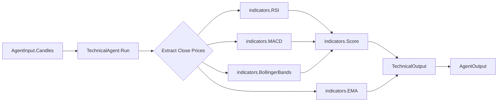
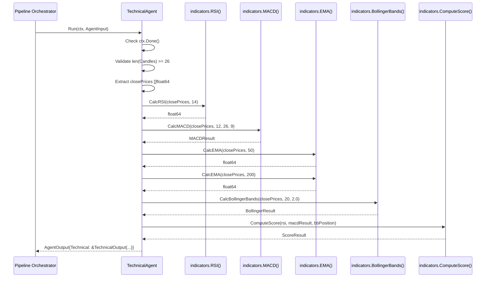
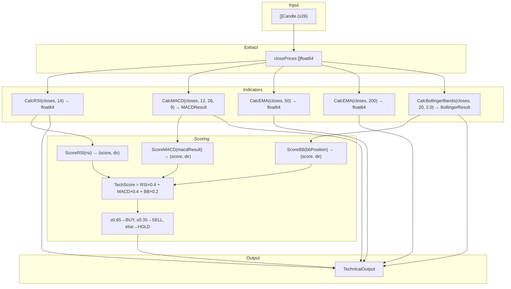

# Design Document: TechnicalAgent (Agent 2)

## Overview

TechnicalAgent is the second agent in the Forex Multi-Agent Bot pipeline. It receives OHLCV candle data (via `AgentInput.Candles`) from MarketDataAgent, computes four technical indicators, aggregates them into a weighted TechnicalScore, and outputs a BUY/SELL/HOLD signal with confidence.

The design follows two key principles:
1. **Pure computation** — All indicator functions are pure (no side effects), accepting `[]float64` and returning deterministic results, making them independently testable.
2. **Single responsibility** — Each indicator lives in its own file within `internal/indicators/`, and the agent merely orchestrates them.

### Key Design Decisions

| Decision | Rationale |
|----------|-----------|
| Pure functions in `indicators` package | Enables property-based testing, no mocking needed |
| Accept `[]float64` (close prices) | Decouples indicators from `Candle` struct, reusable |
| Scorer aggregates sub-scores | Single point for weight tuning, easy to extend |
| Context check at entry only | Indicator math is fast (~microseconds), no need for mid-computation checks |
| EMA-200 computes with available data | Graceful degradation when buffer < 200 candles |

---

## Architecture

### High-Level Data Flow



### Sequence Diagram



---

## Components and Interfaces

### Package: `internal/indicators/`

This package contains pure, stateless functions for computing technical indicators. All functions accept `[]float64` (close prices) and numeric parameters.

#### File: `rsi.go`

```go
package indicators

// CalcRSI computes RSI using Wilder's smoothing method.
// Requires len(closes) >= period + 1.
// Returns RSI value in range [0.0, 100.0].
func CalcRSI(closes []float64, period int) float64
```

**Algorithm — Wilder's Smoothing RSI:**
1. Compute price changes: `delta[i] = closes[i] - closes[i-1]`
2. Separate gains and losses: `gain = max(delta, 0)`, `loss = abs(min(delta, 0))`
3. First average: `avgGain = sum(gains[:period]) / period`, same for losses
4. Subsequent smoothing: `avgGain = (prevAvgGain × (period-1) + currentGain) / period`
5. RS = avgGain / avgLoss
6. RSI = 100 - (100 / (1 + RS))
7. If avgLoss == 0: RSI = 100.0 (no losses → maximum strength)

#### File: `macd.go`

```go
package indicators

// MACDResult holds the output of MACD computation.
type MACDResult struct {
    MACDLine   float64 // EMA(fast) - EMA(slow)
    SignalLine float64 // EMA of MACDLine
    Histogram  float64 // MACDLine - SignalLine
    Crossover  string  // "bullish" | "bearish" | "none"
}

// CalcMACD computes MACD(fast, slow, signal) from close prices.
// Requires len(closes) >= slow + signal.
// Crossover is detected by comparing current and previous histogram signs.
func CalcMACD(closes []float64, fast, slow, signal int) MACDResult
```

**Algorithm:**
1. Compute EMA(fast) series over all closes
2. Compute EMA(slow) series over all closes
3. MACDLine series = EMA(fast) - EMA(slow) at each point
4. SignalLine = EMA(signal) of the MACDLine series
5. Histogram = MACDLine - SignalLine (current bar)
6. Crossover detection: if prev histogram < 0 and current > 0 → "bullish"; if prev > 0 and current < 0 → "bearish"; else "none"

#### File: `moving_average.go`

```go
package indicators

// CalcEMA computes Exponential Moving Average for the given period.
// Returns the final EMA value (last element of the series).
// Multiplier = 2 / (period + 1).
// Seed value: SMA of first `period` elements.
func CalcEMA(closes []float64, period int) float64

// CalcEMASeries computes the full EMA series (used internally by MACD).
// Returns a slice of the same length as closes (first `period-1` entries are 0).
func CalcEMASeries(closes []float64, period int) []float64

// CalcSMA computes Simple Moving Average over the last `period` elements.
func CalcSMA(closes []float64, period int) float64
```

#### File: `bollinger.go`

```go
package indicators

// BollingerResult holds the output of Bollinger Bands computation.
type BollingerResult struct {
    Upper      float64 // SMA + (stddev × multiplier)
    Middle     float64 // SMA(period)
    Lower      float64 // SMA - (stddev × multiplier)
    BBPosition float64 // (close - lower) / (upper - lower), clamped [0,1]
}

// CalcBollingerBands computes Bollinger Bands(period, multiplier).
// Requires len(closes) >= period.
// If upper == lower (zero bandwidth), BBPosition = 0.50.
func CalcBollingerBands(closes []float64, period int, multiplier float64) BollingerResult
```

**Algorithm:**
1. Middle = SMA of last `period` closes
2. StdDev = standard deviation of last `period` closes
3. Upper = Middle + (multiplier × StdDev)
4. Lower = Middle - (multiplier × StdDev)
5. If Upper == Lower: BBPosition = 0.50
6. Else: BBPosition = (lastClose - Lower) / (Upper - Lower)
7. Clamp BBPosition to [0.0, 1.0]

#### File: `scorer.go`

```go
package indicators

// ScoreResult holds the aggregated technical score and derived signal.
type ScoreResult struct {
    RSIScore   float64 // individual RSI score (0.0–1.0)
    RSIDir     string  // "BUY" | "SELL" | "HOLD"
    MACDScore  float64 // individual MACD score
    MACDDir    string
    BBScore    float64 // individual BB score
    BBDir      string
    TechScore  float64 // weighted aggregate
    Signal     string  // final signal
    Confidence float64 // == TechScore
}

// Weights for aggregation
const (
    RSIWeight  = 0.40
    MACDWeight = 0.40
    BBWeight   = 0.20
)

// ScoreRSI converts an RSI value to a directional score.
func ScoreRSI(rsi float64) (score float64, direction string)

// ScoreMACD converts MACD result to a directional score.
func ScoreMACD(macd MACDResult) (score float64, direction string)

// ScoreBB converts a BBPosition to a directional score.
func ScoreBB(bbPosition float64) (score float64, direction string)

// ComputeScore aggregates individual indicator scores into a TechnicalScore
// and determines the final signal.
// Signal thresholds: >= 0.65 → BUY, <= 0.35 → SELL, else → HOLD.
func ComputeScore(rsi float64, macd MACDResult, bbPosition float64) ScoreResult
```

**Scoring Rules:**

| Indicator | Condition | Score | Direction |
|-----------|-----------|-------|-----------|
| RSI | ≤ 30 | 0.85 | BUY |
| RSI | 30 < RSI ≤ 40 | 0.65 | BUY |
| RSI | ≥ 70 | 0.85 | SELL |
| RSI | 60 ≤ RSI < 70 | 0.65 | SELL |
| RSI | 40 < RSI < 60 | 0.50 | HOLD |
| MACD | Bullish crossover | 0.80 | BUY |
| MACD | Bearish crossover | 0.80 | SELL |
| MACD | No crossover, histogram > 0 | 0.60 | BUY |
| MACD | No crossover, histogram < 0 | 0.60 | SELL |
| MACD | No crossover, histogram == 0 | 0.50 | HOLD |
| BB | BBPosition ≤ 0.10 | 0.80 | BUY |
| BB | BBPosition ≥ 0.90 | 0.80 | SELL |
| BB | 0.10 < BBPosition < 0.90 | 0.50 | HOLD |

**Signal Determination:**
```
TechScore = (RSIScore × 0.40) + (MACDScore × 0.40) + (BBScore × 0.20)

if TechScore >= 0.65 → Signal = "BUY"
if TechScore <= 0.35 → Signal = "SELL"
else                 → Signal = "HOLD"

Confidence = TechScore
```

### Package: `internal/agents/`

#### File: `technical_agent.go`

```go
package agents

import (
    "context"
    "fmt"
    "strings"
    "time"

    "github.com/dhnnnn/forex-agent/internal/indicators"
)

// TechnicalAgent (Agent 2) computes technical indicators and produces
// a BUY/SELL/HOLD signal with confidence.
type TechnicalAgent struct{}

func NewTechnicalAgent() *TechnicalAgent
func (a *TechnicalAgent) Name() string // returns "TechnicalAgent"
func (a *TechnicalAgent) Run(ctx context.Context, input AgentInput) AgentOutput
```

**Run method flow:**
1. Check `ctx.Err()` — if cancelled, return error output
2. Validate `len(input.Candles) >= 26` — if not, return error output
3. Extract `closePrices []float64` from candles
4. Call `indicators.CalcRSI(closePrices, 14)`
5. Call `indicators.CalcMACD(closePrices, 12, 26, 9)`
6. Call `indicators.CalcEMA(closePrices, 50)`
7. Call `indicators.CalcEMA(closePrices, 200)`
8. Call `indicators.CalcBollingerBands(closePrices, 20, 2.0)`
9. Call `indicators.ComputeScore(rsi, macdResult, bbResult.BBPosition)`
10. Build `TechnicalOutput` struct
11. Build reason string
12. Return `AgentOutput{Success: true, Technical: &output}`

---

## Data Models

### Input

The agent receives `AgentInput` (already defined in `agent.go`). It reads:
- `AgentInput.Candles []Candle` — rolling buffer of OHLCV data (minimum 26 entries)
- Each `Candle.Close float64` — used for all indicator calculations

### Internal Types (in `indicators` package)

```go
// MACDResult — output of CalcMACD
type MACDResult struct {
    MACDLine   float64
    SignalLine float64
    Histogram  float64
    Crossover  string  // "bullish" | "bearish" | "none"
}

// BollingerResult — output of CalcBollingerBands
type BollingerResult struct {
    Upper      float64
    Middle     float64
    Lower      float64
    BBPosition float64 // [0.0, 1.0]
}

// ScoreResult — output of ComputeScore
type ScoreResult struct {
    RSIScore   float64
    RSIDir     string
    MACDScore  float64
    MACDDir    string
    BBScore    float64
    BBDir      string
    TechScore  float64
    Signal     string
    Confidence float64
}
```

### Output

The agent populates `TechnicalOutput` (already defined in `agent.go`):

```go
type TechnicalOutput struct {
    Signal     string  // "BUY" | "SELL" | "HOLD"
    Confidence float64 // 0.0–1.0 (equals TechScore)
    RSI        float64 // raw RSI value (0–100)
    MACDHist   float64 // MACD histogram value
    EMA50      float64 // EMA-50 value
    EMA200     float64 // EMA-200 value
    BBPosition float64 // 0.0–1.0
    TechScore  float64 // weighted aggregate (same as Confidence)
    Reason     string  // human-readable explanation
}
```

### Data Flow Diagram




---

## Correctness Properties

*A property is a characteristic or behavior that should hold true across all valid executions of a system—essentially, a formal statement about what the system should do. Properties serve as the bridge between human-readable specifications and machine-verifiable correctness guarantees.*

### Property 1: Valid input produces successful output

*For any* `AgentInput` with 26 or more candles containing positive close prices, calling `TechnicalAgent.Run` SHALL return an `AgentOutput` where `Success` is true, `Error` is nil, and `Technical` is non-nil with all fields populated.

**Validates: Requirements 1.2, 1.3, 2.2**

### Property 2: Insufficient data produces error output

*For any* `AgentInput` with fewer than 26 candles (including zero), calling `TechnicalAgent.Run` SHALL return an `AgentOutput` where `Success` is false and `Error` contains a non-nil descriptive error message.

**Validates: Requirements 1.4, 2.1**

### Property 3: RSI range invariant

*For any* slice of close prices with length ≥ 15, `CalcRSI(closes, 14)` SHALL return a value in the range [0.0, 100.0].

**Validates: Requirements 3.2**

### Property 4: RSI scoring correctness

*For any* RSI value in [0, 100], `ScoreRSI(rsi)` SHALL return the score and direction matching the threshold table: ≤30 → (0.85, BUY), (30,40] → (0.65, BUY), [60,70) → (0.65, SELL), ≥70 → (0.85, SELL), (40,60) → (0.50, HOLD).

**Validates: Requirements 4.1, 4.2, 4.3, 4.4, 4.5**

### Property 5: MACD histogram invariant

*For any* slice of close prices with length ≥ slow + signal (≥35), the `MACDResult` returned by `CalcMACD` SHALL satisfy `Histogram == MACDLine - SignalLine` (within floating-point epsilon).

**Validates: Requirements 5.2**

### Property 6: MACD scoring correctness

*For any* `MACDResult`, `ScoreMACD(macd)` SHALL return: crossover "bullish" → (0.80, BUY), crossover "bearish" → (0.80, SELL), no crossover with histogram > 0 → (0.60, BUY), no crossover with histogram < 0 → (0.60, SELL), no crossover with histogram == 0 → (0.50, HOLD).

**Validates: Requirements 6.1, 6.2, 6.3, 6.4, 6.5**

### Property 7: BBPosition range invariant

*For any* slice of close prices with length ≥ 20, `CalcBollingerBands(closes, 20, 2.0)` SHALL return a `BollingerResult` where `BBPosition` is in the range [0.0, 1.0].

**Validates: Requirements 8.2**

### Property 8: Bollinger Bands scoring correctness

*For any* BBPosition value in [0, 1], `ScoreBB(bbPosition)` SHALL return: ≤0.10 → (0.80, BUY), ≥0.90 → (0.80, SELL), (0.10, 0.90) → (0.50, HOLD).

**Validates: Requirements 9.1, 9.2, 9.3**

### Property 9: TechnicalScore weighted aggregation formula

*For any* valid RSI value, MACDResult, and BBPosition, `ComputeScore` SHALL produce a `TechScore` equal to `(RSIScore × 0.40) + (MACDScore × 0.40) + (BBScore × 0.20)` (within floating-point epsilon), where RSIScore, MACDScore, and BBScore are the values returned by ScoreRSI, ScoreMACD, and ScoreBB respectively.

**Validates: Requirements 10.1**

### Property 10: TechnicalScore range invariant

*For any* valid input to `ComputeScore`, the resulting `TechScore` SHALL be in the range [0.0, 1.0].

**Validates: Requirements 10.3**

### Property 11: Signal determination from TechnicalScore

*For any* `ScoreResult`, the `Signal` field SHALL be: "BUY" when `TechScore ≥ 0.65`, "SELL" when `TechScore ≤ 0.35`, and "HOLD" when `0.35 < TechScore < 0.65`.

**Validates: Requirements 11.1, 11.2, 11.3**

### Property 12: Confidence equals TechnicalScore

*For any* valid input, the `TechnicalOutput.Confidence` SHALL equal `TechnicalOutput.TechScore`.

**Validates: Requirements 11.4**

### Property 13: Context cancellation returns error

*For any* cancelled context and any `AgentInput`, calling `TechnicalAgent.Run` SHALL return an `AgentOutput` where `Success` is false and `Error` is non-nil.

**Validates: Requirements 14.1**

### Property 14: Reason includes active indicator descriptions

*For any* input that produces RSI ≤ 30, the `TechnicalOutput.Reason` SHALL contain "RSI oversold"; for RSI ≥ 70, it SHALL contain "RSI overbought"; for a MACD crossover, it SHALL contain the crossover direction; for BBPosition ≤ 0.10 or ≥ 0.90, it SHALL contain a Bollinger Band reference.

**Validates: Requirements 12.2, 12.3, 12.4, 12.5**

---

## Error Handling

### Error Categories

| Error | Condition | Behavior |
|-------|-----------|----------|
| Insufficient data | `len(Candles) < 26` | Return `AgentOutput{Success: false, Error: "need min 26 candles..."}` |
| Context cancelled | `ctx.Err() != nil` | Return `AgentOutput{Success: false, Error: "context cancelled"}` |
| Zero bandwidth BB | All prices identical in BB period | Set BBPosition = 0.50 (graceful degradation, not error) |
| EMA-200 insufficient data | `len(Candles) < 200` | Compute with available data (graceful degradation) |
| Division by zero (RSI) | avgLoss == 0 | Return RSI = 100.0 (maximum strength) |

### Error Handling Strategy

1. **Fail-fast on invalid input** — Validate minimum candle count before any computation. No partial results.
2. **Context check at entry** — Single check before computation starts. Indicator math is fast (μs), so mid-computation checks add overhead without benefit.
3. **Graceful degradation over hard failure** — For EMA-200 with insufficient data and zero-bandwidth Bollinger Bands, produce reasonable defaults rather than erroring.
4. **Descriptive error messages** — Include actual vs. required values (e.g., "need min 26 candles for MACD, got 15").

### Error Flow

```go
func (a *TechnicalAgent) Run(ctx context.Context, input AgentInput) AgentOutput {
    // 1. Context cancellation check
    if ctx.Err() != nil {
        return errorOutput(a.Name(), fmt.Errorf("context cancelled: %w", ctx.Err()))
    }

    // 2. Input validation
    if len(input.Candles) < 26 {
        return errorOutput(a.Name(), fmt.Errorf("need min 26 candles for MACD, got %d", len(input.Candles)))
    }

    // 3. Compute (all indicator functions handle edge cases internally)
    // ...

    // 4. Always returns success if we reach here
    return AgentOutput{Success: true, Technical: &output, ...}
}

func errorOutput(name string, err error) AgentOutput {
    return AgentOutput{
        AgentName: name,
        Success:   false,
        Error:     err,
        Timestamp: time.Now(),
    }
}
```

---

## Testing Strategy

### Dual Testing Approach

This feature is well-suited for property-based testing because:
- All indicator functions are **pure functions** with clear input/output
- The scoring logic has **universal properties** that hold across the full input space
- The input space is large (any sequence of float64 prices)
- Mathematical invariants (range bounds, formula correctness) apply universally

### Property-Based Testing

**Library:** [`pgregory.net/rapid`](https://github.com/flyingmutant/rapid) — a Go property-based testing library with excellent generator support and shrinking.

**Configuration:**
- Minimum 100 iterations per property test
- Each test tagged with: `// Feature: technical-agent, Property N: <property_text>`

**Property tests cover:**
- Range invariants (RSI ∈ [0,100], BBPosition ∈ [0,1], TechScore ∈ [0,1])
- Scoring correctness (threshold-based classification for all indicators)
- Formula invariants (histogram = MACD - signal, weighted aggregation)
- Signal determination (threshold mapping)
- Error conditions (insufficient data, cancelled context)

### Unit Tests (Example-Based)

Unit tests complement property tests for:
- **Known reference values** — Verify RSI/MACD/EMA against manually computed or third-party reference values
- **Interface compliance** — Verify `TechnicalAgent` satisfies the `Agent` interface at compile time
- **Specific edge cases** — Zero bandwidth Bollinger Bands, all-gains RSI (=100), all-losses RSI (=0)
- **Reason string format** — Verify exact "No strong technical signal" string for neutral inputs
- **EMA degradation** — Verify EMA-200 works with < 200 candles

### Test Organization

```
internal/indicators/
├── rsi_test.go           # Property + unit tests for CalcRSI
├── macd_test.go          # Property + unit tests for CalcMACD
├── bollinger_test.go     # Property + unit tests for CalcBollingerBands
├── moving_average_test.go # Property + unit tests for CalcEMA/CalcSMA
└── scorer_test.go        # Property + unit tests for scoring & aggregation

internal/agents/
└── technical_agent_test.go # Integration property tests + unit tests
```

### Generator Strategy

For property tests, use these generators:
- **Close prices**: `rapid.Float64Range(0.5, 2.0)` slices of length 26–200 (forex price range)
- **RSI values**: `rapid.Float64Range(0.0, 100.0)` for scoring function tests
- **BBPosition values**: `rapid.Float64Range(0.0, 1.0)` for BB scoring tests
- **MACDResult**: Struct generator with random histogram and crossover state
- **Candle slices**: Generate from random close prices, with Open/High/Low derived from Close ± small random delta

### Coverage Goals

| Category | Coverage Target |
|----------|----------------|
| Indicator pure functions | 100% line coverage via property tests |
| Scoring functions | 100% branch coverage (all threshold zones) |
| TechnicalAgent.Run | All paths (success, insufficient data, context cancel) |
| Edge cases | Zero bandwidth BB, RSI extremes (0, 100), single-point MACD |
